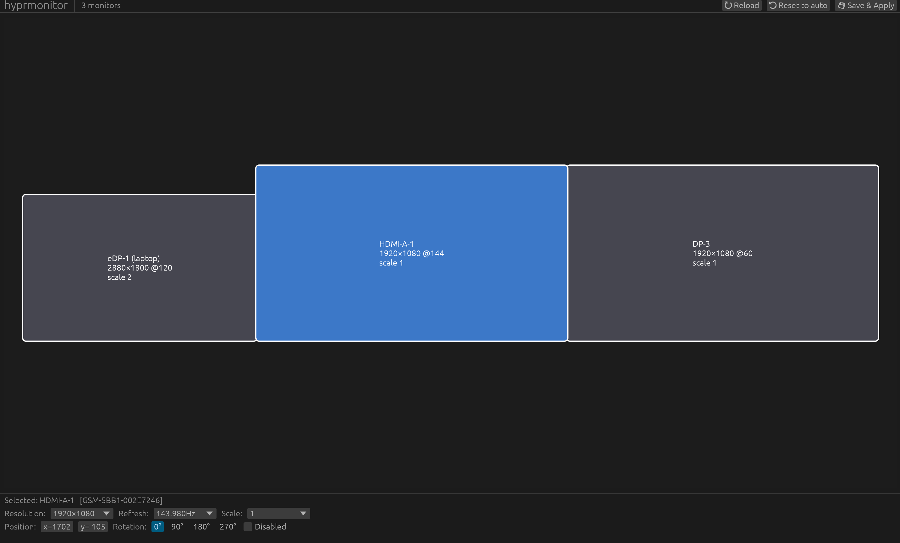

# hyprmonitor

Auto-configures Hyprland monitors when displays are plugged in or out, with an optional drag-and-drop GUI for custom layouts.

- **`hyprmonitor`** — daemon + CLI that picks a sensible mode, scale, and position for every connected monitor and re-applies on hotplug.
- **`hyprmonitor-gui`** — visual editor (egui) for overriding the auto-plan: drag monitors around, change mode / refresh / scale / rotation, save to JSON.

## Install on Arch Linux

From the AUR — tracks the latest commit on `main`:

```sh
# with an AUR helper (recommended)
yay -S hyprmonitor-git
# or
paru -S hyprmonitor-git

# without a helper
git clone https://aur.archlinux.org/hyprmonitor-git.git
cd hyprmonitor-git
makepkg -si
```

The package installs both `hyprmonitor` and `hyprmonitor-gui` to `/usr/bin/`, pulls in `hyprland`, `libnotify`, and the Wayland runtime libs as dependencies, and rebuilds from the latest `main` whenever you reinstall.

For other distros, or to build from source on Arch, see **Build** below.

## Build

```sh
cargo build --release --workspace
```

Two binaries land in the workspace's `target/release/` directory:

- `./target/release/hyprmonitor` — daemon + CLI
- `./target/release/hyprmonitor-gui` — drag-and-drop editor

To use them without typing the full path every time, either install them once:

```sh
sudo install -Dm755 target/release/hyprmonitor /usr/local/bin/hyprmonitor
sudo install -Dm755 target/release/hyprmonitor-gui /usr/local/bin/hyprmonitor-gui
```

…or `cargo install --path .` (CLI only) and `cargo install --path gui` (GUI only). Or just use the full paths below — works either way.

Requires Rust 2021 edition and a live Hyprland session (developed against 0.54.x).

## CLI usage

```sh
hyprmonitor list              # show detected monitors and the plan
hyprmonitor apply             # apply the plan once
hyprmonitor apply --dry-run   # print the hyprctl commands instead of running them
hyprmonitor daemon            # run as a daemon, reacting to hotplug events
hyprmonitor -v <cmd>          # debug logs
```

### Auto-start with Hyprland

Add to `~/.config/hypr/hyprland.conf`:

```
exec-once = /path/to/hyprmonitor daemon
```

## GUI



Open the editor:

```sh
./target/release/hyprmonitor-gui
# or, if installed to PATH:
hyprmonitor-gui
```

Each monitor is a draggable rectangle sized to its **logical footprint** (`mode.width / scale`). Internal panels (eDP/LVDS/DSI) are labelled `(laptop)`.

- **Drag** any rectangle to move it. Drops snap to neighbouring edges within 20px; on release a wider 200px alignment pass closes any small gap so the cursor can cross between monitors. Hyprland only allows cursor travel across exactly-adjacent regions.
- **Click** a monitor to select it (highlighted blue). The inspector at the bottom lets you change resolution / refresh / scale / position / rotation / disabled state.
- **Arrow keys** with a monitor selected nudge by 1 logical px. **Esc** deselects.
- **Save & Apply** (or **Ctrl+S**) validates the layout, writes `~/.config/hyprmonitor/monitors.json`, and runs `hyprctl keyword monitor …` for each enabled monitor. The button greys out and shows `⚠ <reason>` if monitors overlap or a mode isn't supported.
- **Reload** re-queries Hyprland (use after a hotplug while the GUI is open). **Reset to auto** discards overrides and shows the daemon's automatic plan (still requires Save to persist).

The saved JSON keys each monitor on an **EDID-derived identifier** (manufacturer + product + serial, with a week/year fallback when the serial is zero), so a different monitor on the same connector never inherits your saved layout.

## How the daemon picks the auto-plan

For each monitor, when no override is set:

1. **Mode:** the EDID-preferred resolution if available, otherwise the highest pixel count, then the highest refresh rate at that resolution.
2. **Scale:** computed from the EDID diagonal DPI — `<110 → 1.0`, `<140 → 1.25`, `<170 → 1.5`, `<220 → 1.75`, `≥220 → 2.0`. Falls back to `1.0` if EDID is unreadable.
3. **Position:** monitors laid out left-to-right at `y = 0`. Internal panel goes first, then externals sorted by connector name. Effective width = `mode.width / scale`.

On every reconfigure, the daemon reads `~/.config/hyprmonitor/monitors.json` (if present) and overlays its entries onto the auto-plan — matched by EDID id, then by connector name. Monitors marked `"disabled": true` are dropped from the plan.

When you close your laptop lid, the eDP disappears from Hyprland's monitor list and the daemon's next reconfigure promotes the externals to fill the layout. Reopening puts it back.

## Limitations

- Verify-after-apply only compares resolution, not refresh rate (the value isn't surfaced by the Hyprland crate we use).
- No VRR / HDR / mirroring controls. Layer those on yourself in `hyprland.conf`.
- The GUI doesn't yet watch the config file — daemon picks up changes on the next hotplug. Run `hyprmonitor apply` after editing the JSON if you need it sooner.
